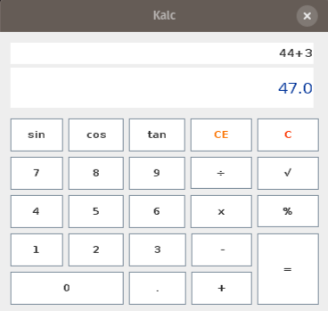

# Kalc
This is just a calculator application made in java using netbeans for a school assignment. It was 2016 and in my 3th semester
at the university i was not aware of the importance of having a clean code.

